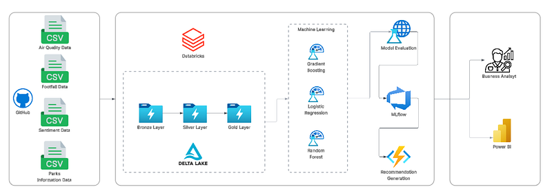
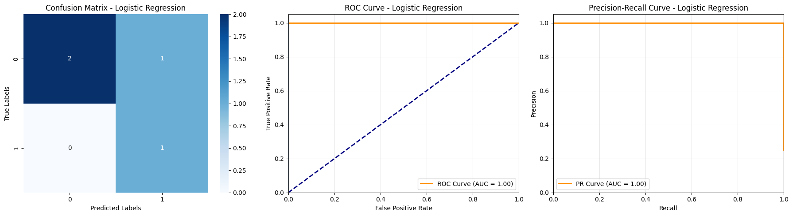
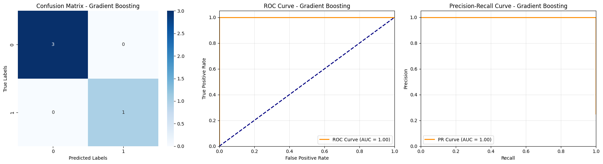
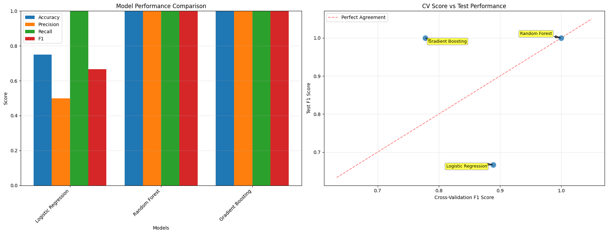
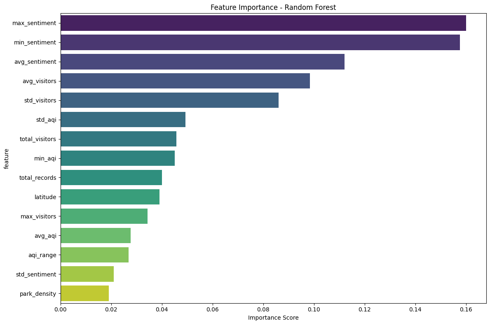
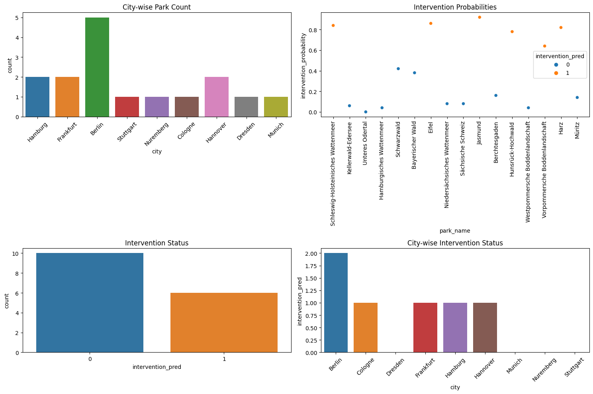
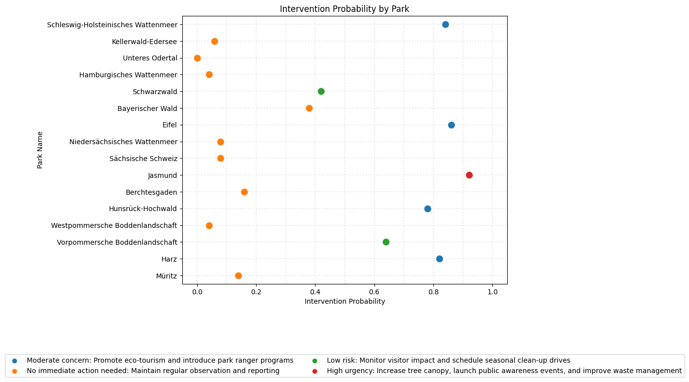

# 🌳 AI-Powered Urban Green Space Management System (UGSMS)

## 🚀 Project Overview

The **Urban Green Space Management System (UGSMS)** is an end-to-end machine learning solution developed to support data-driven, proactive park management across 16 national parks in Germany. By integrating environmental indicators, human activity patterns, and public sentiment, UGSMS identifies when and where interventions are needed to improve park quality, accessibility, and environmental impact.


---

## 🔑 Key Features

- ✅ **Multi-source Data Integration**: Ingests air quality, footfall, sentiment, and park data.
- ⚡ **Real-time Data Processing**: Uses Apache Spark for scalable and efficient processing.
- 🧠 **ML Pipeline**: Logistic Regression, Random Forest, and Gradient Boosting for prediction.
- 🏛️ **Delta Lake Architecture**: Bronze → Silver → Gold medallion model.
- 📈 **MLflow Integration**: Tracks experiments, models, and metrics.
- 🎯 **Automated Recommendations**: Actionable outputs for park improvement planning.

---

## 🌍 Project Value

- 🌱 **Proactive Park Management**
- 🔧 **Efficient Resource Allocation**
- 📊 **Data-Driven Decision Making**
- 🍃 **Enhanced Environmental Impact**

---
## 📁 Project Structure

```bash
📦 ugsms/
├── notebooks/
│   ├── 1_data_ingestion.py
│   ├── 2_data_cleaning.py
│   ├── 3_feature_engineering.py
│   ├── 4_ml_pipeline.py
│   ├── 5_model_evaluation.py
│   └── 6_recommendations.py
├── data/
│   └── *.csv (synthetic data)
├── README.md
└── requirements.txt
```
---

## 📦 Architecture

The system architecture is designed to find a balance between **scalability**, **maintainability**, and **performance**.



### Step 1: Data Ingestion and Cleaning
The first step in developing the UGSMS is to ingest and clean the data from various sources.

**Note on Data:** For the purpose of this project, synthetic data was generated to simulate real-world environmental, usage, and sentiment patterns. These data files are stored in a GitHub repository and are used directly for ingestion into the system.

* **Air Quality Data** (`national_parks_air_quality.csv`)
    * Air Quality Index (AQI)
    * NO2, PM2.5, O3 levels
* **Footfall Data** (`national_parks_footfall.csv`)
    * Visitor counts
    * Event day indicators
* **Sentiment Data** (`national_parks_sentiment.csv`)
    * Tweet text analysis
    * Sentiment scores (-1 to 1)
    * Sentiment labels
* **Parks Information** (`german_national_parks.csv`)
    * Geographic coordinates
    * Area measurements

The data ingestion process involves reading the CSV files into Spark DataFrames using the `read_data` function.
The `clean_data` function performs several cleaning operations:

* **Removing null values:** The function uses `df.dropna` to remove rows with null values in any column except for empty strings.
* **Converting timestamp columns:** If the DataFrame contains a timestamp column, the function converts it to a timestamp data type using `to_timestamp`. The format `M/d/yyyy H:mm` is used to parse the timestamp.
* **Casting data types:** The function casts the `visitor_count` column to an integer data type using `col("visitor_count").cast("integer")`. Similarly, it casts the `event_day` column to a boolean data type using `col("event_day").cast("boolean")`.

By cleaning and preprocessing the data, the system ensures that it is in a suitable format for further analysis and modeling.

Functions:
```python
def read_data(url): ...
def clean_data(df): ...
```

---

### Step 2: Data Storage and Medallion Architecture
The system implements a medallion architecture with three layers:
- **Bronze**: Raw, unprocessed data from sources
- **Silver**: Cleaned and integrated data
- **Gold**: Aggregated, business-ready data and predictions

---

### Step 3: Feature Engineering
The **UGSMS** uses feature engineering to create **park-level aggregated features** from time-series data.

The `create_aggregated_features` function performs the following operations:  

- **Grouping data**: The function groups the data by `park_id`, `name`, `city`, `area_sqm`, `latitude`, and `longitude` using `groupBy`.  
- **Aggregating features**: The function aggregates various features, including air quality, visitor counts, sentiment scores, and event days, using `agg`.  
- **Creating derived features**: The function creates derived features, such as `aqi_range`, `sentiment_range`, `event_frequency`, and `park_density`, using `withColumn`.

The aggregated features are then used as input to machine learning models to predict intervention requirements.

```python
def create_aggregated_features(df_spark): ...
```

---

### Step 4: Target Variable Creation
The target variable `intervention_required` is created based on business logic.

The `create_target_variable` function creates the `intervention_required` target variable based on the following conditions:  

- **Air quality**: If the maximum AQI is greater than 100, intervention is required.  
- **Sentiment and air quality**: If the maximum AQI is greater than 75 and the minimum sentiment score is less than 0, intervention is required.  
- **Sentiment**: If the minimum sentiment score is less than -0.5, intervention is required.  
- **Visitor count and park area**: If the maximum visitor count is less than 50 and the park area is greater than 10,000 square meters, intervention is required.

The target variable is used to train machine learning models to predict intervention requirements.
```python
def create_target_variable(df_spark): ...
```

---

### Step 5: Machine Learning Pipeline

ML Algorithms Used:
- Logistic Regression
- Random Forest
- Gradient Boosting

Each model is built using:
```python
def create_ml_pipelines(): ...
```

Hyperparameter tuning via `GridSearchCV` with custom `param_grids`.

---

### Step 6: Model Evaluation & Comparison

Evaluation metrics:
- Accuracy
- Precision
- Recall
- F1-Score
- AUC-ROC

Visual tools include:
- Confusion Matrix
- ROC Curve & Precision-Recall Curve
- Model Performance Comparison & CV Score vs Test F1 Score

**Figure: Evaluating logistic_regression_performance.**





```python
def evaluate_model_performance(...): ...
def create_model_comparison_visualization(...): ...
```

---

### Step 7: MLflow Integration
All models and experiments are logged using MLflow.
The MLflow integration enables comprehensive model management and reproducibility.
```python
with mlflow.start_run(...): ...
```

---

### Step 8: Feature Importance
The feature importance is analyzed for the best-performing model:



```python
def analyze_feature_importance(...): ...
```

---

### Step 9: Saving & Visualizing Predictions

Model outputs are saved to Spark tables.
To help park managers understand the recommendations, the system generates visualizations that show the intervention probabilities and corresponding recommendations for each park.



```python
def save_predictions_to_spark(...): ...
```

---

### 🔮 Step 10: Recommendation Engine
The system uses a custom-built function to generate recommendations based on predicted intervention probability and park data.
The `generate_recommendation` function takes into account the predicted intervention probability and the city to provide a tailored recommendation.



```python
def generate_recommendation(prob, city): ...
```

---

## 🛠️ Installation

This project is built for **Databricks Community Edition**.

1. Clone the repo:
```bash
git clone https://github.com/yourusername/UGSMS.git
```
2. Upload notebooks to Databricks
3. Create a cluster with:
   - Runtime: 12.x LTS (Scala 2.12, Spark 3.x)
4. Run notebooks sequentially

---

## 🤝 Contributing

Pull requests are welcome! Please fork the repo and open a PR.

---

## 📄 License

This project is licensed under the MIT License.

---

## 📬 Contact

Made with ❤️ by **Dilshan Chanuka**  
🔗 [LinkedIn](https://www.linkedin.com/in/dilshan-chanuka/)  
